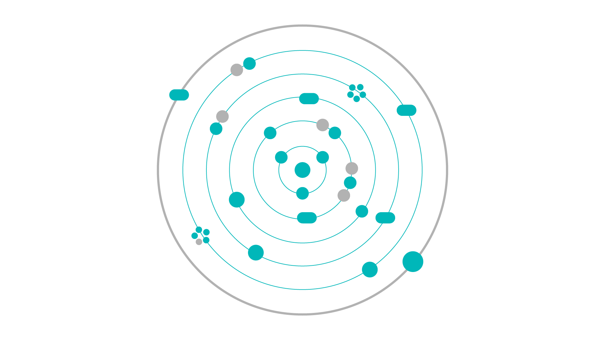

# Proje Yönlendirme Grafiği

Bu proje, grafik üzerinde yer alan dairelere tıklayarak farklı projelere yönlendirmenizi sağlar. Dairelerin her biri belirli bir projeye bağlanmıştır ve o projeye tıklanarak erişim sağlanabilir.

## Grafik Görüntüsü



## Kullanım

Her bir daireye tıklayarak ilgili projeye yönlenebilirsiniz.

### HTML Kodu:

Aşağıdaki HTML kodunu kullanarak interaktif bir grafik oluşturduk:

```html
<!DOCTYPE html>
<html lang="tr">
<head>
    <meta charset="UTF-8">
    <meta name="viewport" content="width=device-width, initial-scale=1.0">
    <title>Proje Yönlendirme</title>
    <style>
        body {
            display: flex;
            justify-content: center;
            align-items: center;
            height: 100vh;
            background-color: #f4f4f4;
        }
        .container {
            position: relative;
            width: 800px;
            height: 800px;
            background-image: url('grafik.png'); /* Grafik dosyanızı buraya ekleyin */
            background-size: cover;
        }
        .circle {
            position: absolute;
            width: 50px;
            height: 50px;
            border-radius: 50%;
            background-color: rgba(0, 128, 128, 0.7);
            display: flex;
            justify-content: center;
            align-items: center;
            color: white;
            cursor: pointer;
        }
        /* Dairelerin yerleşimi */
        #circle1 { top: 50px; left: 300px; }
        #circle2 { top: 200px; left: 400px; }
        #circle3 { top: 400px; left: 100px; }
        /* Yeni daireleri bu şekilde ekleyebilirsiniz */
    </style>
</head>
<body>
    <div class="container">
        <div id="circle1" class="circle" onclick="redirectTo('https://github.com/ft_printf')">ft_printf</div>
        <div id="circle2" class="circle" onclick="redirectTo('https://github.com/proje2')">Proje 2</div>
        <div id="circle3" class="circle" onclick="redirectTo('https://github.com/proje3')">Proje 3</div>
    </div>

    <script>
        function redirectTo(url) {
            window.location.href = url;
        }
    </script>
</body>
</html>
